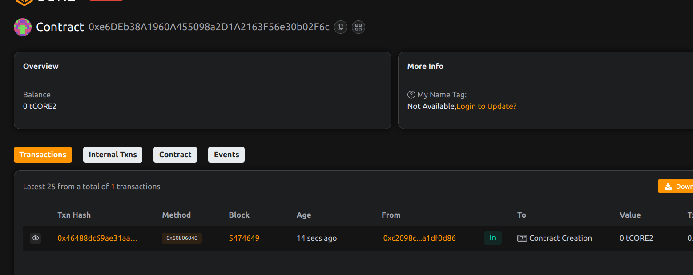

# DecentraDocs: Decentralized Document Signing and Storage

## Project Description

DecentraDocs is a blockchain-based platform that revolutionizes document management through decentralized signing and storage. The platform enables users to create, sign, and manage documents in a completely decentralized manner, ensuring immutability, transparency, and security. With multi-signature support and tamper-proof storage, DecentraDocs provides a trustless environment for legal and business document management.

## Project Vision

Our vision is to eliminate the need for centralized authorities in document verification and storage by creating a fully decentralized ecosystem. We aim to provide individuals and businesses with a secure, transparent, and cost-effective solution for document management that leverages blockchain technology to ensure authenticity and prevent fraud.

## Key Features

- **Decentralized Document Storage**: Store document hashes on-chain ensuring immutability and transparency
- **Multi-Signature Support**: Require multiple parties to sign documents before completion
- **Document Lifecycle Management**: Track document creation, signing progress, and completion status
- **Access Control**: Only authorized signers can sign specific documents
- **Document Revocation**: Creators can revoke documents before completion if needed
- **Fee-Based Storage**: Sustainable model with minimal storage fees for document creation
- **Real-Time Tracking**: Monitor signing progress and document status in real-time

## Future Scope

- **IPFS Integration**: Integrate with IPFS for storing actual document content alongside blockchain hashes
- **Digital Identity Verification**: Implement KYC/AML integration for verified document signing
- **Template System**: Create reusable document templates for common use cases
- **Legal Framework Integration**: Partner with legal institutions for legally binding document recognition
- **Mobile Application**: Develop mobile apps for document signing on-the-go
- **Notification System**: Implement push notifications for document signing requests
- **Advanced Permissions**: Role-based access control with granular permissions
- **Document Versioning**: Support for document revisions and version control
- **Integration APIs**: APIs for enterprise integration with existing document management systems

## Contract Details
0xe6DEb38A1960A455098a2D1A2163F56e30b02F6c
